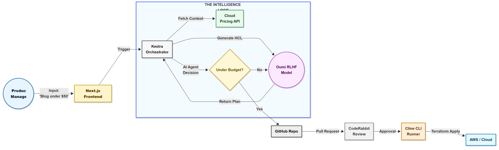

<div align="center">

# 🏗️ Stackframe

**Give form to your infrastructure.**  
_The AI Architect that converts natural language into budget-aware, compliant Infrastructure-as-Code._

[stackframe.vercel.app](https://stackframe.vercel.app) • [oumi.ai](https://oumi.ai) • [kestra.io](https://kestra.io) • [Cline](https://www.google.com/search?q=https://github.com/cline-cli/cline) • [CodeRabbit](https://coderabbit.ai)

</div>

## 🚀 The Problem

Startups and developers struggle to set up cloud infrastructure that is secure, scalable, and cost-effective. Manual Terraform is slow and error-prone. Cloud pricing is opaque until after deployment. Default configurations expose teams to security risks.

## 💡 The Solution: Stackframe

Stackframe is an autonomous “Platform Engineer in a Box.” You describe what you need, the Oumi-trained AI architect generates the Terraform, Kestra validates it against pricing and budgets, CodeRabbit audits it, and Cline deploys it. A full infra lifecycle handled by intelligent automation.

## 🏆 Prize Tracks & Integrations

This project was built to maximize sponsor technology usage.

|            Sponsor            | Integration                                                    |     Status      |
| :---------------------------: | :------------------------------------------------------------- | :-------------: |
|     **Wakanda (Kestra)**      | AI Agent for pricing intelligence and budget-gate decisions    | [ ] Implemented |
| **Iron Intelligence (Oumi)**  | RLHF-tuned model that generates valid, optimized Terraform HCL | [ ] Implemented |
|  **Infinity Build (Cline)**   | CLI automation for init, plan, and apply stages                | [ ] Implemented |
| **Captain Code (CodeRabbit)** | Automated IaC security review on every PR                      | [ ] Implemented |
|   **Stormbreaker (Vercel)**   | Next.js dashboard deployed as the real-time control center     | [ ] Implemented |

## ⚙️ Architecture

<div align="center"></div>

## 🛠️ Getting Started (Local Dev)

### Prerequisites

Node.js 18+, Docker (for Kestra & Oumi), Terraform CLI, and Cline CLI.

### 1. Clone & Install

```bash
git clone https://github.com/yourusername/stackframe.git
cd stackframe
bun install
```

### 2. Run Kestra

```bash
docker run -p 8080:8080 kestra/kestra:latest server local
```

Import the flow from `/kestra/stackframe-flow.yaml` into `http://localhost:8080`.

### 3. Run Frontend

```bash
npm run dev
```

### 4. Configure Cline

Ensure `.cline/tasks.json` is set, then test:

```bash
cline run infra-plan
```

## 🧠 The AI Model (Oumi)

A Llama-3.2-3B model fine-tuned using Oumi’s RLHF pipeline (GRPO). Dataset: `data/terraform-instruct.jsonl`. Training objective: generate Terraform that passes `terraform plan` and respects budgets. Training configuration is in `/oumi/train.py`.

## 🛡️ Security & Governance

Terraform state is locked through S3/DynamoDB (simulated locally). No infra is deployed without CodeRabbit approval and human review. Kestra enforces budget gating and rejects expensive plans automatically.

## 🔮 Roadmap

- [ ] Multi-cloud support
- [ ] Automated drift-detection agent
- [ ] Visual drag-and-drop architecture editor

## 👥 Team

**Saket Rathi** — Full Stack Developer

<div align="center">Built with ❤️ for the WeMakeDevs Hackathon 2025.</div>
